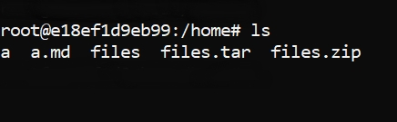
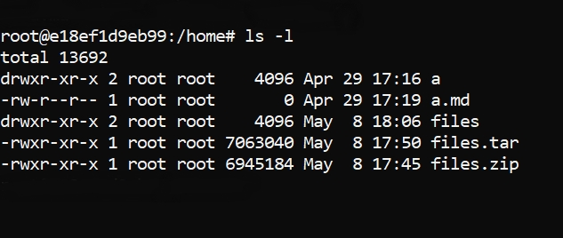
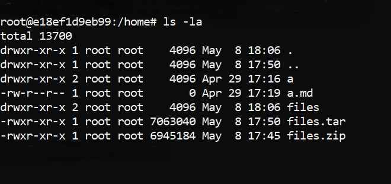
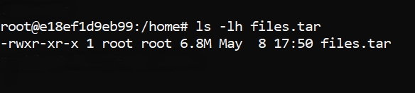
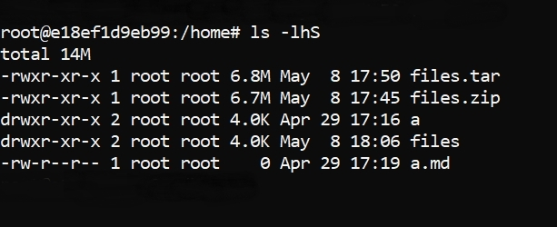

# __ls__
The ls command is used to list the directories and files within the current directory (also known as folder). Below are a few examples of how the ls command can be used to view the contents of a directory.
* **ls** : list of files or directories
```bash
    ls
```


* **ls -l** : will show you all the files and directories with **detailed information**.
```bash
    ls -l
```


* **ls -la** : will show you all the files and directories with **detailed information** with **hidden fiels**.
```bash
    ls -la
```


* **ls -lh <file_name>** : will show you detailes of specific file/directory.
```bash
    ls -lh <file_name>
```


* **ls -lhS** : will show you the files in sorted manner based on its size.
```bash
    ls -lhS
```
