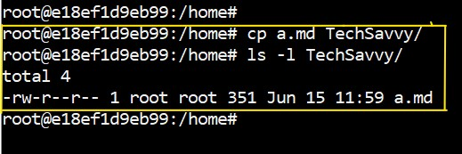

# Commands
1. [ls - list](#ls_commands)
2. [cd - change directory](#change_directory)
3. [cp - copy](#cd_and_mv)
4. [Common Commands](#commoncommands)
5. [Video's](#for-videos-on-it-i-techsavvy)

<br>
<br>
<br>


<div style="text-align: center"> 
<h1 id="ls_commands">ls - command</h1>
</div>
The ls command is used to list the directories and files within the current directory (also known as folder). Below are a few examples of how the ls command can be used to view the contents of a directory.

* **ls** : list of files or directories

```bash
    ls
``` 
 

* **ls -l** : will show you all the files and directories with **detailed information**.
```bash
    ls -l
```


* **ls -la** : will show you all the files and directories with **detailed information** with **hidden fiels**.
```bash
    ls -la
```


* **ls -lh <file_name>** : will show you detailes of specific file/directory.
```bash
    ls -lh <file_name>
```


* **ls -lhS** : will show you the files in sorted manner based on its size.
```bash
    ls -lhS
```


</br>
</br>


<div style="text-align: center;">
  <h1 id="change_directory">cd - command</h1>
</div>

The cd command is fundamental in navigating the file system in Linux. Here are some examples and less commonly known uses:

* **cd** : cd means change directory[also know as folder], used to navigate from one folder to another folder.
```bash
    cd
```


* **cd <path/folder_name>** : This command will navigate to the folder based on given path or folder name.
```bash
    cd TechSavvy
```

* **cd ~** : This command provides a direct path to your home directory, regardless of your working directory.

```bash
    cd ~
```

* **cd $OLDPWD** : This command will stores the previous directory you were in. This can be useful if you want to switch back to that directory without typing its full path.

```bash
    cd $OLDPWD
```

* **cd -** : You can use this command to shift between two directories. For example, if you were in /home/user/documents and then went to /var/log, you can use cd - to go back to /home/user/documents and then use it again to go back to /var/log.

```bash
    cd -
```

* **cd Down + TAB** : If you enter few characters of command/file/folder name and hit enter it will auto fill rest of the characters. If more then one file is availabe for your given characters it will show you all the possible files or folders.
```bash
    cd Down + TAB # cd Downloads
    cd Do + TAB + TAB # Documents Downloads
```
<br>
<br>
<br>
<div style="text-align: center;">
    <h1 id="cd_and_mv"> cp & mv - commands</h1>
</div>

* **cp** : This command is used to copy files from one location to another location. And below are the examples:

There is nothing under **TechSavvy** directory.


<br>
Now, will copy the **a.md** file to **TechSavvy** directory using following command.
<br>


* **cp file_path_ destination_path** : Using following command we can a file to a folder.

```bash
cp a.md TechSavvy/
```


* **cp -r dir_name destination_dir_name** : It is similar to file copy command but we should mention **-r** for directory or folder. Using following command we can a directory or folder from one location to another location 
```bash
cp -r folder1/ folder_2
```


* **mv a.md TechSavvy** : This command is used to move a file or directory to directory/folder.
```bash
mv a.md TechSavvy
```


<div style="text-align: center">
<h1 id="commoncommands">Common Commands</h1>
</div>

* __pwd - Print Working Directory__ : This command is used to print the path of a current working directory.

```bash
    pwd
```


* **< command>+ help** : Using help command you can find the support for that specific command.
```bash
ls --help 
```

* **!!** : This will give you the previous command which you recently executed.
```bash
!!
```
* **history** : This command will helps you to print the previously executed commands with serial numbers.
```bash
history
```

* **!n** : In place of n you need place number of a command which was in history. That command will be executed. 
```bash
!131
```


# For videos on it [@i-TechSavvy](https://www.youtube.com/@i-TechSavvy)